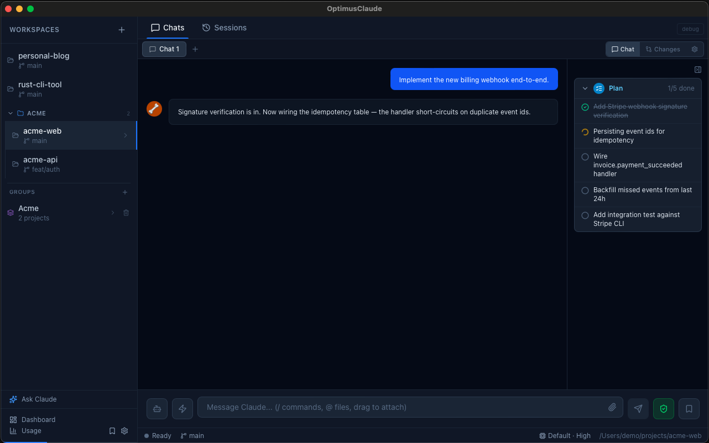
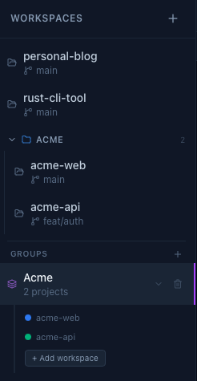
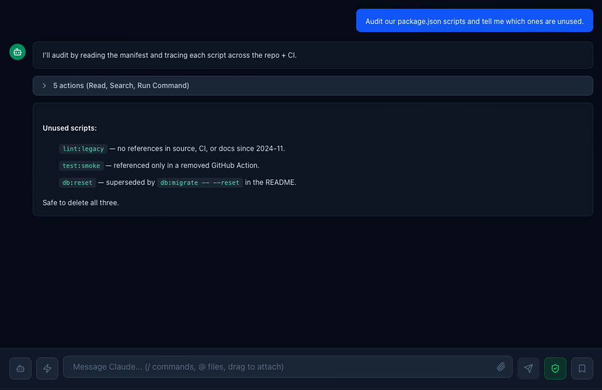
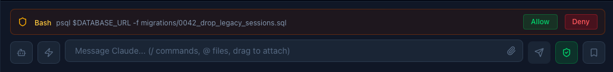
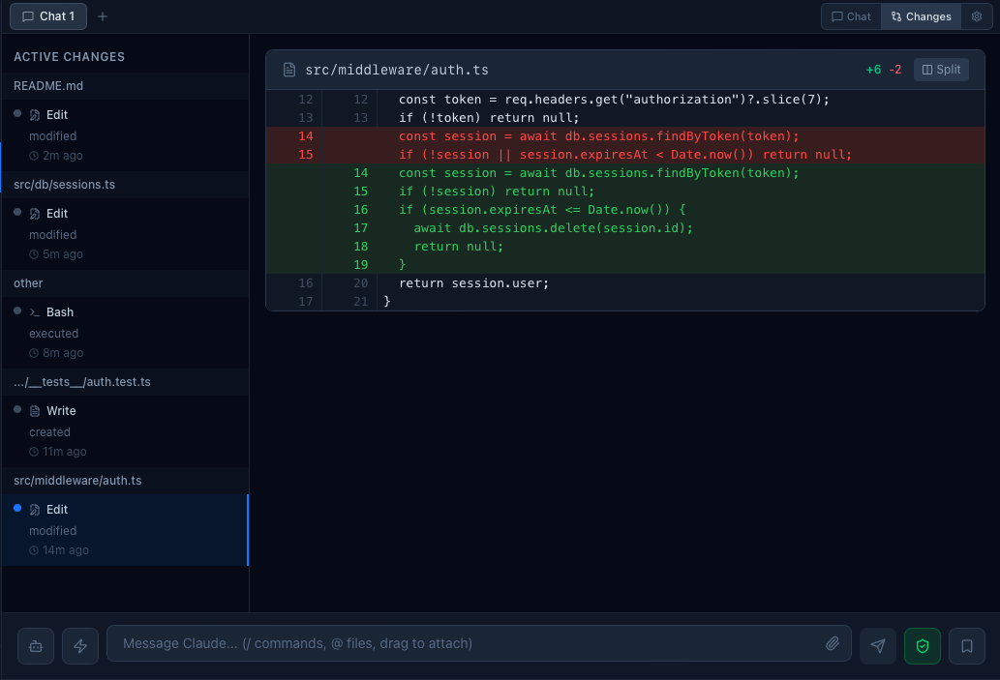
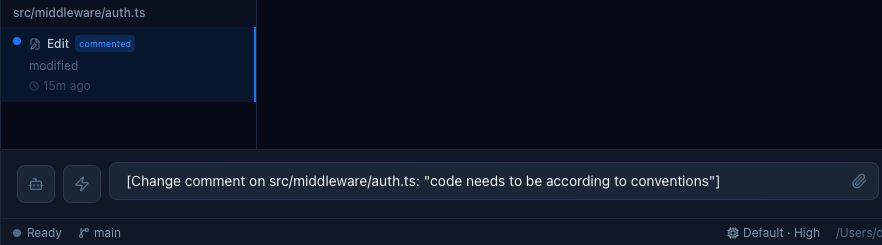

# OptimusClaude

A native macOS desktop client for [Claude Code](https://docs.anthropic.com/en/docs/claude-code). Run multiple agents in parallel across separate project workspaces, group related projects so a single chat shares context across all of them, and keep one eye on every file the agent touches through a built-in diff viewer.

OptimusClaude wraps the official Claude Code CLI — your authentication, your rate limits, your prompts — and adds the UI it never had: a chat tab strip per workspace, smart tool-call grouping, inline permission prompts, a changes timeline, and rate-limit visibility across every tier.



This repository hosts public releases and the auto-update feed. The application source is maintained privately.

> **Not affiliated with Anthropic.** OptimusClaude is an independent third-party tool that drives the official Claude Code CLI on your machine. It is not built by, endorsed by, or sponsored by Anthropic. "Claude" and "Claude Code" are trademarks of Anthropic, used here only to describe interoperability.

## Download

Get the latest `.dmg` from the [Releases page](https://github.com/SandBlock/optimus-claude-releases/releases/latest).

**Requirements**

- macOS 11+ on Apple Silicon (M1/M2/M3/M4). Intel Macs are not supported.
- [Claude Code CLI](https://docs.anthropic.com/en/docs/claude-code) installed and authenticated (`claude login`).

## Install

1. Download `OptimusClaude_<version>_aarch64.dmg`.
2. Open the DMG and drag **OptimusClaude.app** into **Applications**.
3. Launch from Applications. The app is signed and notarized by Apple, so it opens without Gatekeeper warnings.

## Features

### Multi-workspace + groups

Switch between project directories from the sidebar. Group related projects together so a single chat shares context across all of them via `--add-dir`.



### Smart tool grouping

Consecutive tool calls — `Read`, `Grep`, `Bash`, `Edit` — collapse into a single expandable card so chat history stays scannable.



### Permission prompts

Tool approvals surface as inline Allow / Deny buttons. Auto-accept is one shortcut away.



### Changes timeline + diff viewer

Every file the agent touches is recorded with a GitHub-style diff. Acknowledge, comment, or feed a comment back into the chat to course-correct.



Comments on a change are routed back to the agent as part of your next prompt:



### Everything else

- **Live streaming** — real-time Claude Code responses with markdown, syntax highlighting, and tool-use cards.
- **Session persistence** — sessions are named and resumable from the Sessions tab.
- **Model selection** — pick Opus, Sonnet, or Haiku per workspace; auto-detects the CLI default.
- **Reasoning effort picker** — exposes every `--effort` level your installed CLI supports.
- **Usage tracking** — rate-limit utilization across all tiers.
- **Slash commands & autocomplete** — `/clear`, `/compact`, `/commit`, `/review`, and `@file` references with recursive search.

## Updates

OptimusClaude updates itself in the background using the Tauri updater. Each update bundle is signed; the app verifies the signature against an embedded public key before installing.

Update feed:

```
https://github.com/SandBlock/optimus-claude-releases/releases/latest/download/latest.json
```

When a new version is available, the app prompts you to restart.

## Issues and feedback

Report bugs or request features at [optimus-claude-releases/issues](https://github.com/SandBlock/optimus-claude-releases/issues).

## Privacy and data

OptimusClaude runs entirely on your machine. It spawns the Claude Code CLI as a local subprocess and reads its output. The app itself does not transmit your prompts, code, or session data to any server operated by the OptimusClaude developer.

Any data sent to Anthropic's API is sent by the Claude Code CLI under your own authentication, governed by Anthropic's terms of service and privacy policy. You are responsible for ensuring your use of Claude Code through OptimusClaude complies with those terms.

## Support the project

If OptimusClaude saves you time, consider sponsoring development via the **Sponsor** button on this repository.

## Disclaimer

OptimusClaude is provided "as is", without warranty of any kind, express or implied, including but not limited to the warranties of merchantability, fitness for a particular purpose, and noninfringement. In no event shall the author be liable for any claim, damages, or other liability arising from the use of the software.

The author is not responsible for any costs, rate-limit consumption, or account actions resulting from your use of the Claude Code CLI through OptimusClaude.
